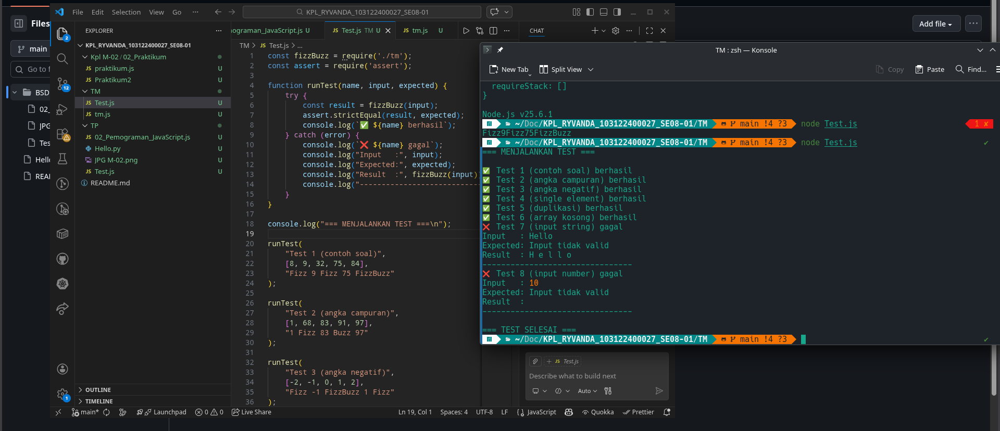

# Tugas Pendahuluan 02: Pemrograman JavaScript

**Nama:** Ryvanda
**NIM:** 103122400027
**Kelas:** SE-08-01

## Program/Kode

Tersedia di [tm.js](./tm.js) , [Test.js](./Test.js)

**Output**

**Deskripsi Program**

Program ini menerima input larik (array) dan mengembalikan deretan bilangan dan "Fizz" untuk kelipatan 2, "Buzz" untuk kelipatan 7, dan "FizzBuzz" untuk kelipatan 14. Beri nama berkas program sebagai tm.js dan taruh di direktori TM.

Output dari program ini tertera pada gambar di atas
