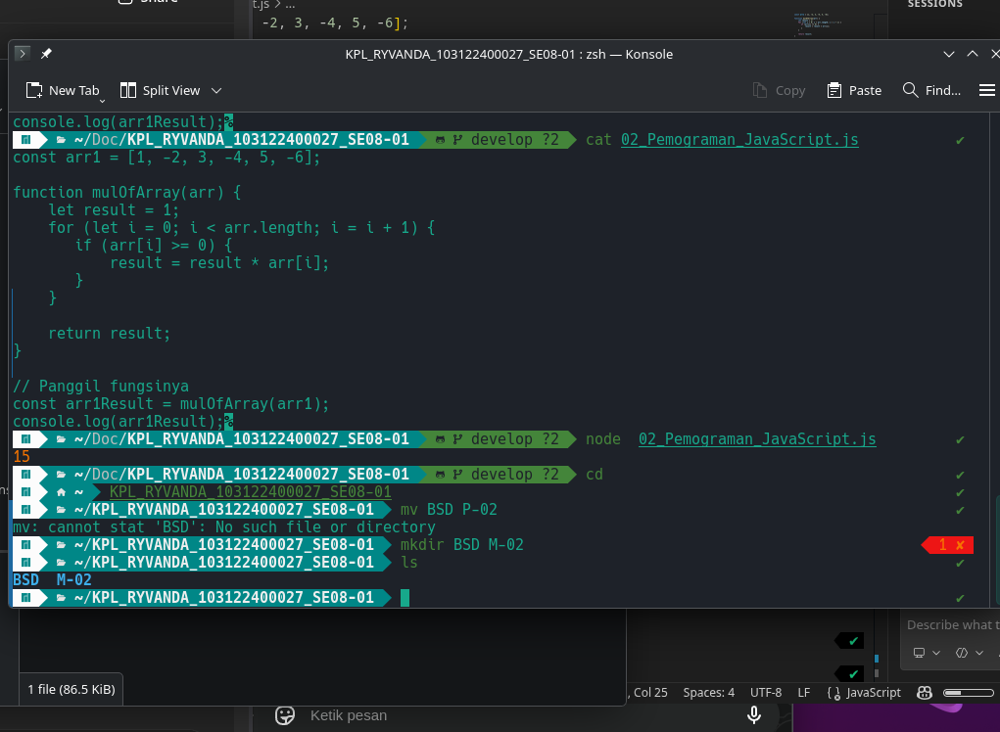

# Tugas Pendahuluan 02: Pemrograman JavaScript

**Nama:** Ryvanda
**NIM:** 103122400027
**Kelas:** SE-08-01

## Program/Kode

Tersedia di [02_Pemograman_JavaScript.js](./02_Pemograman_JavaScript.js)

**Output**

**Deskripsi Program**

Program ini menjalankan perkalian semua bilangan positif dalam larik (array). Ini akan bekerja untuk bilangan positif, nol, dan negatif.

Jadi Ubah kondisi >= 0 jadi > 0 biar si angka 0 diskip dari perkalian. Karena nol tidak lebih besar dari nol, dia bakal dianggap sama kayak angka negatif cuma numpang lewat di array tanpa boleh masuk ke algoritma yang udah dibikin jadi hasil akhirnya ada di **1456** dan nggak jadi nol.