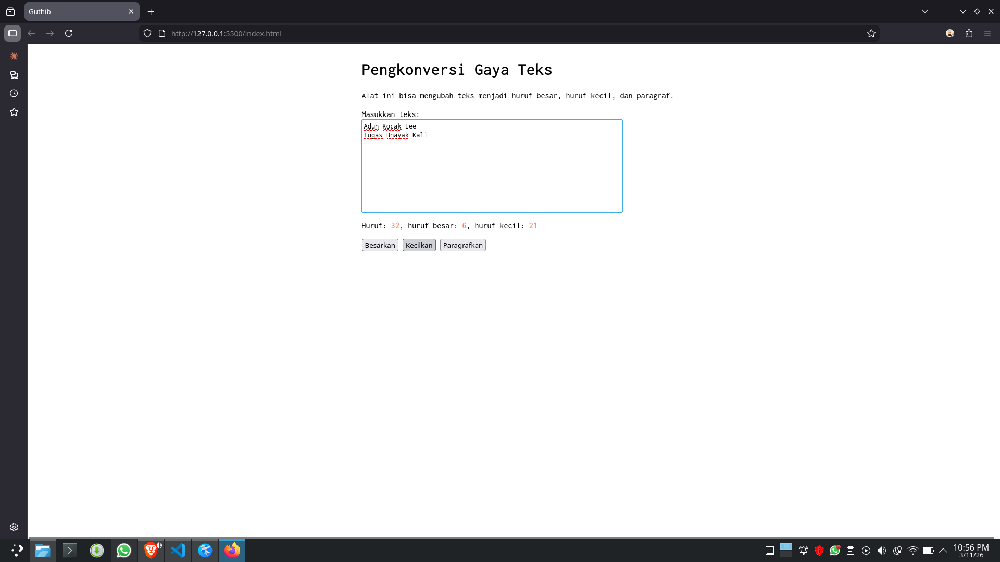

 # Tugas Pendahuluan: GUI dengan HTML dan CSS

**Nama:** Ryvanda
**NIM:** 103122400027
**Kelas:** SE-08-01

## Tugas

Buatlah tata letak laman yang kamu buat berada di tengah seperti di bawah ini, dan juga ubah font-nya dengan Inconsolata dari Google Fonts.

## Program/Kode

Tersedia di [index.html](./index.html), [index.css](./index.css), [scripts.js](./scripts.js)

## Output

## Deskripsi Program

Dalam pembuatan website ini, saya membangun struktur HTML yang mencakup area input teks, panel statistik karakter, dan tombol kontrol format. Saya melakukan penataan visual menggunakan CSS dengan menerapkan metode Flexbox agar tampilan presisi di tengah layar, serta mengintegrasikan Google Fonts "Inconsolata" untuk memberikan kesan tipografi monospace yang modern. Untuk fungsionalitasnya, saya mengembangkan logika JavaScript yang mampu menghitung jumlah karakter, huruf besar, dan huruf kecil secara real-time menggunakan Regular Expression. Selain itu, saya membuat fungsi transformasi teks yang memungkinkan pengguna mengubah format menjadi huruf kapital semua, huruf kecil semua, atau format paragraf yang secara otomatis mengkapitalisasi huruf pertama di setiap awal kalimat.