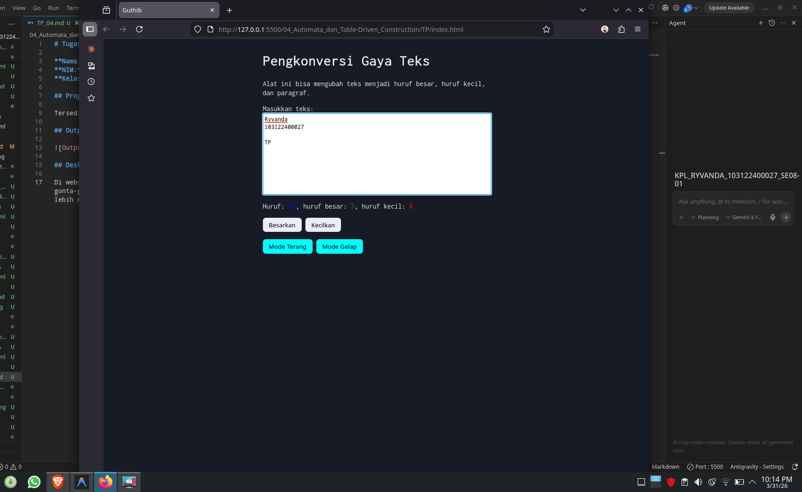

# Tugas Pendahuluan: Automata dan Table-Driven Construction

**Nama:** Ryvanda
**NIM:** 103122400027  
**Kelas:** SE-08-01

## Program/Kode

Tersedia di [index.html](./index.html), [index.css](./index.css), [scripts.js](./scripts.js)

## Output

## Deskripsi

Di website ini, saya menambahkan fitur Dark dan Light Mode. Jadi, pengguna tinggal klik satu tombol saja, dan JavaScript bakal otomatis gonta-ganti tema halamannya dengan cara menyelipkan class mode gelap ke dalam struktur HTML-nya. Simpel tapi bikin pengalaman browsing jadi lebih nyaman di mata.