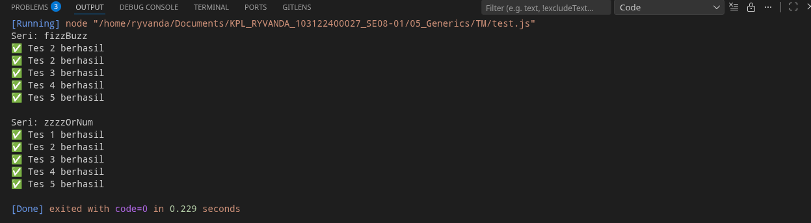

# Tugas Mandiri 05: Generic

**Nama:** Ryvanda
**NIM:** 103122400027
**Kelas:** SE-08-01

## Tugas

Diberikan program fizz.js seperti ini:

```
// Tambah JSDoc di sini
function zzzzOrNum(value) {
    // Ubah kode di sini
}

// Tambah JSDOC di sini
function fizzBuzz(sequence) {
    // Ubah kode di sini

    const newSequence = sequence.map((e) => zzzzOrNum(e));

    return newSequence;
}

module.exports = {
    fizzBuzz: fizzBuzz,
    zzzzOrNum: zzzzOrNum,
};
```

Aturan FizzBuzz kali ini adalah:

1. Fungsi fizzBuzz hanya menerima larik yang semua elemennya terdiri dari bilangan bulat dan mengeluarkan larik pula yang bisa jadi bercampur string dan bilangan
2. Fungsi zzzzOrNum hanya menerima sebuah data tunggal berupa bilangan bulat dan mengembalikan "Fizz", "FizzBuzz", "Buzz", atau bilanga bulat sesuai logikanya
3. Kedua fungsi harus ada dan harus disertai JSDoc sesuai tipe data yang disiratkan dari no. 1, no. 2, dan perilaku yang diharapkan di bawah
4. fizzBuzz harus menggunakan fungsi zzzzOrNum di dalamnya

Gunakan konfigurasi ini untuk [tsconfig.json](./tsconfig.json) dan [test.js](./test.js) ini untuk menguji kode yang kamu buat

## Kode Sumber

Tersedia di [fizz.js](./fizz.js) dan [test.js](./test.js)

## Output



## Deskripsi Program

Program ini adalah implementasi FizzBuzz pakai JavaScript yang dibantu sama JSDoc buat simulasi tipe data statis. Jadi, di sini ada dua fungsi utama: zzzzOrNum buat ngecek angka satu-satu (apakah dia Fizz, Buzz, atau FizzBuzz), sama fungsi fizzBuzz yang gunanya buat memproses kumpulan angka dalam bentuk array sekaligus.

Nah ini tu bakalan ngecek apakah angka yang kita inputkan adalah kelipatan 3 dan 5, hanya kelipatan 3 atau hanya kelipatan 5. Jika dia kelipatan 3 dan 5 output yang dikeluarkan adalah FizzBuzz, jika dia hanya kelipatan 3 output yang dikeluarkan adalah Fizz, dan jika dia hanya kelipatan 5 maka output yang dihasilkan adalah Buzz.