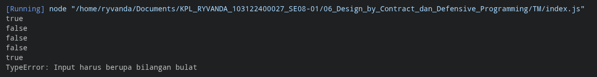

# Tugas Mandiri: Design by Contract dan Defensive Programming

**Nama:** Ryvanda
**NIM:** 103122400027  
**Kelas:** SE-08-01

## Program/Kode

Tersedia di [index.js](./index.js)

## Output

Repositori ini berisi implementasi fungsi **is_not_fizzbuzz** menggunakan JavaScript

## 📝 Deskripsi Kode

Pada tugas mandiri ini, saya menerapkan prinsip *Design by Contract* (DbC) dalam membangun fungsi `is_not_fizzbuzz`. Kontrak yang dibentuk antara pemanggil (*caller*) dan fungsi terdiri dari dua bagian utama: **pre-condition** yang harus dipenuhi sebelum fungsi dijalankan, dan **post-condition** yang menjamin kebenaran hasil keluarannya.

Rincian implementasi yang diterapkan dalam kode ini meliputi:
1. **Pre-condition (Kontrak Masukan):** Sebelum memproses apapun, fungsi memverifikasi bahwa argumen yang diterima adalah bilangan bulat (*integer*) murni menggunakan `Number.isInteger()`. Apabila kontrak ini dilanggar (misalnya dengan mengirim `undefined`, `3.14`, atau string), fungsi akan melempar `TypeError` sebagai sinyal bahwa pemanggil tidak memenuhi kewajibannya.
2. **Logika Inti (Post-condition):** Fungsi menjamin akan mengembalikan `false` jika angka masukan merupakan kelipatan dari 3, 5, atau 15 (FizzBuzz), dan mengembalikan `true` untuk angka lainnya. Jaminan ini adalah *post-condition* dari kontrak tersebut.
3. **Penanganan Pelanggaran Kontrak:** Blok `try-catch` digunakan di sisi pemanggil untuk mengelola `TypeError` yang dilempar saat pre-condition tidak terpenuhi. Ini memisahkan tanggung jawab antara fungsi (menegakkan kontrak) dan pemanggil (menangani kegagalan kontrak).

Dengan kata lain, pendekatan DbC dalam kode ini membantu mendefinisikan batasan yang jelas antara komponen, sehingga kesalahan dapat terdeteksi lebih cepat dan pada tempat yang tepat.