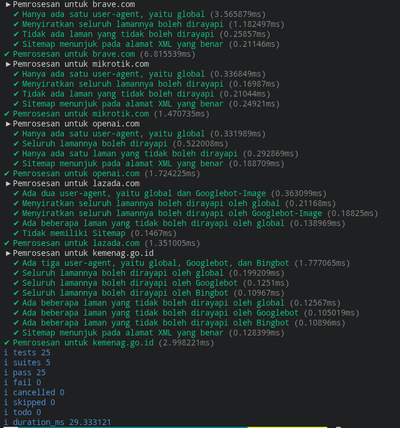

# Tugas Mandiri: Grammar-based Input Processing

**Nama:** Ryvanda  
**NIM:** 103122400027  
**Kelas:** SE-08-01

## Program/Kode

Tersedia di [index.js](./index.js)

## Output

Repositori ini berisi implementasi fungsi **Grammar-based Input Processing** pakai JavaScript buat menuntaskan tugas Praktikum Konstruksi Perangkat Lunak (KPL) Modul 7.

## 📝 Deskripsi Kode

Tugas Mandiri Modul 7 ini mengeksplorasi konsep *Grammar-based Input Processing*, yakni teknik membaca dan menginterpretasikan teks terstruktur berdasarkan aturan tata bahasa (*grammar*) yang telah ditetapkan. Implementasi utamanya adalah fungsi `parseRobots`, sebuah *parser* yang mampu mengurai format file `robots.txt` dari teks mentah menjadi struktur objek JavaScript.

Pendekatan yang digunakan dalam parser ini mengikuti pola *line-by-line processing*:

1. **Tokenisasi Baris:** Teks masukan dipecah menjadi token-token (unit terkecil) berupa baris individu menggunakan `.split('\n')`. Setiap baris kemudian diperlakukan sebagai satu unit aturan (*directive*) yang akan dianalisis lebih lanjut.
2. **Pengelolaan State (Finite State Machine):** Parser mempertahankan sebuah variabel *state* untuk melacak `User-agent` mana yang sedang aktif. Ini mencerminkan konsep *Finite Automata* di mana perilaku parser bergantung pada kondisi saat ini, bukan hanya pada input yang masuk.
3. **Penanganan Karakter Khusus:** Setiap baris dibersihkan menggunakan `.trim()` dan diperiksa apakah dimulai dengan `#` (penanda komentar dalam format robots.txt) agar baris non-direktif diabaikan dengan benar.
4. **Rekonstruksi Struktur Data:** Setiap direktif yang valid (`Allow`, `Disallow`, `Sitemap`) dipetakan ke dalam objek JavaScript yang hierarkis, mengubah format teks datar menjadi representasi data yang dapat diolah secara programatik.

Implementasi ini mendemonstrasikan bagaimana sebuah program dapat "memahami" teks berformat khusus secara otomatis, sebagaimana prinsip dasar dari teori *grammar* dan *parsing* dalam ilmu komputer.