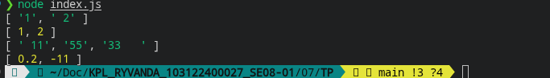

# Tugas Pendahuluan: Grammar-based Input Processing

**Nama:** Ryvanda  
**NIM:** 103122400027  
**Kelas:** SE-08-01

## Program/Kode

Tersedia di [index.js](./index.js)

## Output

Repositori ini berisi implementasi fungsi **Grammar-based Input Processing** pakai JavaScript buat menuntaskan tugas Praktikum Konstruksi Perangkat Lunak (KPL) Modul 7.

## 📝 Deskripsi Kode

Tugas Pendahuluan Modul 7 ini berfokus pada penerapan teknik *input processing* berbasis aturan untuk mengubah data tekstual atau array mentah menjadi array numerik yang valid. Fungsi inti yang diimplementasikan adalah `toNumberArray`, yang dirancang untuk menangani **dua jenis input sekaligus**: `String` dan `Array`.

Alur pemrosesan input pada fungsi ini memiliki dua jalur berbeda:

1. **Jalur String:** Jika input berupa string, fungsi langsung memecahnya menggunakan `.split(',')` dan mengembalikan hasilnya. Ini menangani kasus seperti `"1, 2"` yang langsung dipecah menjadi `["1", "2"]`.
2. **Jalur Array:** Jika input berupa array, fungsi mengiterasi setiap elemen. Setiap elemen dikonversi ke string terlebih dahulu menggunakan `String(...).trim()` untuk menghapus spasi, lalu dikonversi ke angka dengan `Number(...)`. Elemen hanya dimasukkan ke hasil akhir jika memenuhi dua syarat: `!isNaN(num)` (merupakan angka valid) DAN `cleanValue !== ""` (bukan string kosong)—mencegah string kosong yang secara keliru dikonversi menjadi `0` oleh `Number("")`.

Fungsi ini mencontohkan prinsip penting dalam konstruksi perangkat lunak: **jangan pernah mempercayai input mentah**. Dengan mendukung dua tipe input dan menerapkan validasi berlapis, program menjadi resilien terhadap berbagai variasi format masukan yang tidak sempurna.
