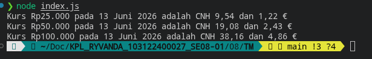

# Tugas Mandiri: Runtime Configuration dan Internationalization

**Nama:** Ryvanda  
**NIM:** 103122400027  
**Kelas:** SE-08-01

## Program/Kode

Tersedia di [index.js](./index.js)

## Output

## 📝 Jawaban Tugas Mandiri

Tugas Mandiri Modul 8 ini mengintegrasikan dua konsep penting dalam pengembangan perangkat lunak modern: **Runtime Configuration** untuk mengelola konfigurasi secara dinamis, dan **Internationalization (i18n)** untuk menyajikan data dalam format yang sesuai dengan konteks lokal pengguna.

### Implementasi Runtime Configuration (.env)
Alih-alih menanamkan URL API secara langsung di dalam kode (*hardcoding*), program ini mengadopsi pola *externalizing configuration*. Prinsip ini, yang merupakan salah satu dari *The Twelve-Factor App*, menyatakan bahwa konfigurasi yang berubah antar lingkungan (*development*, *staging*, *production*) harus dipisahkan dari kode.
1. **Pemisahan Kepentingan (Separation of Concerns):** Nilai `BASE_API` disimpan dalam file `.env` yang tidak perlu di-*commit* ke repositori. Ini memastikan kode aplikasi murni dan bebas dari data yang bersifat lingkungan-spesifik.
2. **Keamanan Kredensial:** Pendekatan ini secara efektif mencegah bocornya API key atau URL endpoint sensitif ke publik, sebuah risiko keamanan yang umum terjadi akibat *hardcoding*.
3. **Konfigurasi Bersih:** Penggunaan opsi `quiet` pada *dotenv* membungkam pesan yang tidak perlu di konsol, menjaga output program tetap bersih dan hanya menampilkan informasi yang relevan.

### Internationalization (Intl.NumberFormat & Intl.DateTimeFormat)
Objek `Intl` adalah API bawaan JavaScript yang menyediakan operasi sensitif bahasa dan wilayah. Dalam tugas ini, `Intl` digunakan untuk menyajikan data kurs mata uang sesuai konvensi lokal Indonesia (`id-ID`).
1. **Representasi Mata Uang yang Benar:** `Intl.NumberFormat` dengan konfigurasi `style: 'currency'` dan `currency: 'IDR'` secara otomatis menghasilkan format Rupiah yang benar—lengkap dengan simbol mata uang, pemisah ribuan (titik), dan pemisah desimal (koma)—tanpa perlu manipulasi string manual.
2. **Format Tanggal Lokal:** `Intl.DateTimeFormat` mengkonversi objek `Date` dari API menjadi format tanggal berbahasa Indonesia (misalnya: "24 April 2026") secara otomatis, mengeliminasi kebutuhan untuk membuat tabel pemetaan nama bulan secara manual.

### Analisis Runtime
Program ini mendemonstrasikan bagaimana sebuah aplikasi dapat berperilaku adaptif: `process.env` memungkinkan konfigurasi diubah tanpa menyentuh kode, sementara `Intl` memungkinkan *presentation layer* menyesuaikan format data berdasarkan lokasi pengguna. Kombinasi keduanya menghasilkan aplikasi yang lebih *maintainable*, *secure*, dan siap untuk digunakan di berbagai konteks budaya.