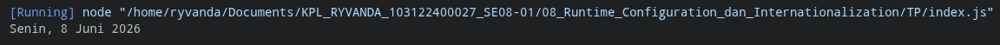

# Tugas Pendahuluan: Runtime Configuration dan Internationalization

**Nama:** Ryvanda  
**NIM:** 103122400027  
**Kelas:** SE-08-01

## Program/Kode

Tersedia di [index.js](./index.js)

## Output

## 📝 Jawaban Tugas Pendahuluan

Tugas Pendahuluan Modul 8 ini merupakan pengantar praktis dari konsep *Internationalization* (i18n), yang berfokus pada kemampuan program untuk menyajikan informasi waktu sesuai dengan konvensi bahasa dan budaya pengguna—dalam hal ini, bahasa Indonesia—tanpa mengubah logika inti program.

### Implementasi Intl.DateTimeFormat
Tantangan utama dalam tugas ini adalah menghasilkan format tanggal **"Sabtu, 18 April 2026"** secara programatik. Pendekatan yang diterapkan menggunakan `Intl.DateTimeFormat` sebagai solusi yang lebih elegan dibandingkan pendekatan naif dengan array pemetaan bulan.
1. **Deklaratif vs Imperatif:** Dengan `Intl.DateTimeFormat`, kita cukup mendeklarasikan *apa yang kita inginkan* (locale `id-ID`, format `long` untuk hari dan bulan) tanpa harus mendefinisikan *bagaimana caranya*. Ini membuat kode jauh lebih ringkas dan bebas dari potensi kesalahan pemetaan manual.
2. **Skalabilitas Lokalisasi:** Mengubah locale dari `id-ID` ke `en-US` atau `ja-JP` hanya memerlukan perubahan satu parameter, menunjukkan betapa skalabelnya pendekatan ini jika aplikasi perlu mendukung banyak bahasa di masa depan.

### Manipulasi Tanggal (Date Manipulation)
Selain menampilkan tanggal sekarang, kode ini juga menekankan pada logika pengolahan waktu. Untuk mendapatkan tanggal kemarin, dua metode `Date` digunakan secara berurutan:
* `getDate()`: Mengambil angka tanggal hari ini dari objek `Date`.
* `setDate()`: Menetapkan tanggal baru dengan mengurangi 1 dari tanggal saat ini (`getDate() - 1`). Node.js secara otomatis menangani *overflow* bulan—misalnya jika tanggal saat ini adalah 1 Januari, maka hasilnya akan menjadi 31 Desember tahun sebelumnya tanpa perlu logika penanganan khusus.

### Analisis Runtime
Modul ini menegaskan bahwa *Runtime Configuration dan Internationalization* bukan sekadar tentang format teks, melainkan tentang prinsip desain yang lebih luas: memisahkan data dari cara data tersebut dipresentasikan. Objek `Date` menyimpan nilai waktu yang universal (dalam milidetik sejak epoch), sementara `Intl.DateTimeFormat` bertugas menerjemahkan nilai tersebut ke dalam representasi yang bermakna bagi pengguna dari wilayah tertentu—sebuah penerapan nyata dari prinsip *Separation of Concerns*.