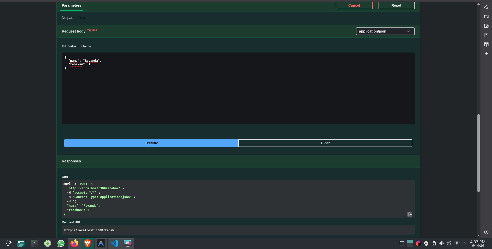

# Tugas Mandiri: API Design dan Construction Using Swagger

**Nama:** Ryvanda  
**NIM:** 103122400027  
**Kelas:** SE-08-01

## Program/Kode

Tersedia di [index.js](./index.js) dan [swagger.js](./swagger.js)

## Output

## 📝 Jawaban Tugas Mandiri

Tugas Mandiri Modul 9 ini memadukan dua aspek penting dalam pengembangan API profesional: **pembuatan logika bisnis yang deterministik** dan **penyediaan dokumentasi API interaktif menggunakan Swagger/OpenAPI 3.0**. Keduanya bekerja bersama untuk membentuk sebuah layanan backend yang fungsional sekaligus mudah dikonsumsi oleh pengembang lain.

### Implementasi Logika Tebak Angka Deterministik
Persyaratan utama tugas ini adalah fungsi tebakan yang menghasilkan angka yang **konsisten** untuk nama yang sama, namun **berbeda** untuk penulisan nama yang berbeda (case-sensitive). Solusi yang diimplementasikan memanfaatkan sifat matematis yang melekat pada karakter:
1. **Penjumlahan Nilai ASCII:** Setiap karakter dalam string `nama` diiterasi, dan nilai kode ASCII-nya (diperoleh via `charCodeAt(0)`) dijumlahkan. Karena huruf kecil dan huruf besar memiliki nilai ASCII yang berbeda (misalnya, 'a' = 97 vs 'A' = 65), kepekaan terhadap huruf besar-kecil (*case-sensitivity*) terpenuhi secara inheren tanpa logika tambahan.
2. **Pembatasan Rentang via Modulo:** Hasil penjumlahan ASCII kemudian dimodulo dengan 100 (`% 100`) untuk memetakan nilai ke rentang 0-99, lalu ditambah 1 untuk menggeser ke rentang final **1-100** sesuai spesifikasi soal.

### Dokumentasi API dengan Swagger
Dokumentasi API yang baik sama pentingnya dengan API itu sendiri. Integrasi Swagger diimplementasikan menggunakan `swagger-jsdoc` dan `swagger-ui-express`:
* **Dokumentasi sebagai Kode (Docs-as-Code):** Spesifikasi API didefinisikan menggunakan komentar JSDoc langsung di atas setiap *route handler*. Pendekatan ini memastikan dokumentasi selalu sinkron dengan implementasi karena keduanya berada di berkas yang sama.
* **Skema Request yang Eksplisit:** Properti `requestBody` yang terdefinisi dalam dokumentasi Swagger secara jelas mengomunikasikan kepada konsumen API bahwa endpoint POST membutuhkan objek JSON dengan properti `nama` (string) dan `tebakan` (integer), sehingga mengurangi ambiguitas dan potensi kesalahan integrasi.

### Penanganan Request Body (Middleware)
Middleware `express.json()` adalah komponen kritis yang sering diabaikan. Tanpa middleware ini, *payload* JSON yang dikirim oleh client tidak akan pernah di-*parse* oleh Express, membuat `req.body` selalu bernilai `undefined`. Dengan mendaftarkannya secara global via `app.use()`, seluruh *route* dalam aplikasi secara otomatis mendapatkan kemampuan untuk membaca dan memproses data JSON dari setiap permintaan yang masuk.