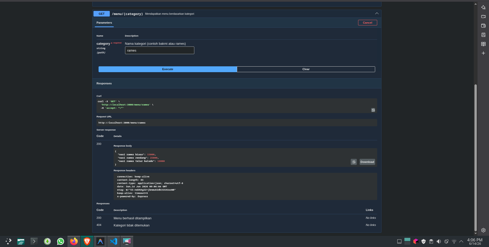

# Tugas Pendahuluan: API Design dan Construction Using Swagger

**Nama:** Ryvanda  
**NIM:** 103122400027  
**Kelas:** SE-08-01

## Program/Kode

Tersedia di [index.js](./index.js)

## Output

## 📝 Jawaban Tugas Pendahuluan

Tugas Pendahuluan Modul 9 ini merupakan pengantar ke dalam dunia *API Design* dengan membangun endpoint yang melayani data menu makanan yang terorganisir secara kategori. Fokus tugas ini bukan hanya pada fungsi API-nya, tetapi juga pada *bagaimana* API tersebut dirancang agar mudah dipahami dan digunakan.

### Implementasi Routing Berbasis Kategori
Pendekatan sentral dalam tugas ini adalah penggunaan *Path Parameter* pada Express.js untuk menciptakan endpoint yang dinamis dan ekspresif.
1. **Arsitektur Data Terpisah:** Data menu diorganisasi ke dalam objek JavaScript yang terstruktur berdasarkan kategori. Pemisahan ini mencerminkan prinsip *Single Source of Truth*, di mana setiap perubahan data cukup dilakukan di satu tempat tanpa harus mengubah logika *routing*.
2. **Routing Dinamis:** Endpoint `GET /menu/:category` menggunakan *path parameter* `category` yang nilainya diekstrak dari URL secara dinamis oleh Express. Ini jauh lebih efisien dan *scalable* dibandingkan membuat endpoint terpisah untuk setiap kategori menu.

### Dokumentasi API dengan Swagger (OpenAPI)
Modul ini memperkenalkan Swagger sebagai standar industri untuk mendokumentasikan RESTful API. Manfaatnya melampaui sekadar dokumen referensi:
* **Kontrak API yang Jelas:** Dokumentasi Swagger mendefinisikan "kontrak" antara penyedia API (*backend*) dan konsumennya (*frontend*, klien). Kontrak ini mencakup format URL, parameter yang dibutuhkan, dan struktur respons yang diharapkan.
* **Pengujian Mandiri yang Terintegrasi:** Fitur *Try it out* pada Swagger UI memungkinkan siapa pun untuk menguji endpoint langsung dari browser, memvalidasi bahwa routing dan logika penanganan parameter bekerja sesuai rancangan tanpa memerlukan alat eksternal seperti Postman.

### Analisis Design Pattern dalam Konteks API
Pengembangan API modern tidak terlepas dari penerapan pola desain (*design patterns*). Dalam implementasi ini, Express *middleware* bertindak sebagai **Structural Pattern** yang mengatur alur pemrosesan setiap permintaan (autentikasi, parsing, logging) sebelum sampai ke handler utama. Sementara itu, pengelolaan data menu yang terpusat mencerminkan esensi dari **Repository Pattern**, yang memisahkan logika akses data dari logika bisnis. Kombinasi pola-pola ini menghasilkan arsitektur yang mematuhi prinsip *Open/Closed*—mudah diperluas untuk fitur baru tanpa merusak yang sudah ada.