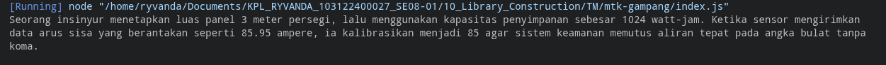

# Tugas Mandiri: Library Construction

**Nama:** Ryvanda  
**NIM:** 103122400027  
**Kelas:** SE-08-01

## Program/Kode

Tersedia di [index.js](./index.js), [bulat.js](./mtk-gampang/lib/bulat.js), [kuadrat.js](./mtk-gampang/lib/kuadrat.js), [pangkat.js](./mtk-gampang/lib/pangkat.js)

## Output

## 📝 Jawaban Tugas Mandiri

Pada Tugas Mandiri Modul 10 ini, saya membangun sebuah pustaka (*library*) npm bernama `mtk-gampang` dari awal. Tugas ini mensimulasikan proses nyata pembuatan dan penerbitan paket perangkat lunak yang dapat digunakan kembali (*reusable*), sebuah keterampilan fundamental dalam pengembangan ekosistem perangkat lunak.

### Implementasi Library Construction
Arsitektur pustaka ini dirancang dengan mengutamakan prinsip **Single Responsibility Principle (SRP)**. Setiap berkas hanya mengandung satu fungsi dengan satu tanggung jawab yang jelas:

1.  **`pangkat.js`**: Berisi fungsi `pangkat(x, y)` untuk menghitung hasil eksponen dari nilai x pangkat y. Menggunakan fungsi `Math.pow(x, y)` yang merupakan cara standar JavaScript untuk melakukan operasi eksponen.
2.  **`bulat.js`**: Berisi fungsi `bulat(x)` yang menggunakan `Math.trunc(x)` untuk membulatkan bilangan desimal ke bilangan bulat dengan cara memotong bagian desimalnya (*truncation*). Ini berbeda dari `Math.round()`—misalnya, `Math.trunc(-4.9)` menghasilkan `-4`, bukan `-5`.
3.  **`kuadrat.js`**: Mengimplementasikan fungsi `kuadrat(x)` yang menghitung akar kuadrat (*square root*) dari x menggunakan `Math.sqrt()`.

### Pola Ekspor Impor (ES Modules)
Pilihan untuk menggunakan **ESM (ECMAScript Modules)** bukan CommonJS (`require`) adalah keputusan desain yang disengaja:
* **Gerbang Masuk Tunggal (Single Entry Point):** Semua fungsi dari folder `lib/` diimpor ke `index.js` dan diekspor kembali sebagai satu objek terpadu. Pola ini memberikan pengguna pustaka satu titik akses yang konsisten, sembari menyembunyikan detail struktur internal folder `lib/`.
* **Instalasi Lokal:** Pustaka ini dirancang untuk dapat diinstal menggunakan `npm install <path-lokal>`, sebuah praktik penting dalam pengembangan *monorepo* atau saat menguji pustaka sebelum diterbitkan ke npmjs.com.

### Analisis Struktur Pustaka
Berkas `package.json` adalah "identitas" dari sebuah pustaka npm. Konfigurasi `"type": "module"` di dalamnya adalah pengaturan kunci yang menginstruksikan Node.js untuk memperlakukan seluruh berkas `.js` sebagai ES Module. Ini memungkinkan dukungan untuk fitur modern seperti *tree-shaking* oleh *bundler* seperti Webpack atau Rollup, yang secara otomatis menghapus kode yang tidak digunakan dari *bundle* produksi, menghasilkan ukuran aplikasi akhir yang lebih kecil.