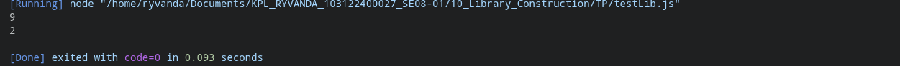

# Tugas Pendahuluan: Library Construction

**Nama:** Ryvanda  
**NIM:** 103122400027  
**Kelas:** SE-08-01

## Program/Kode

Tersedia di [index.js](./index.js)

## Output

## 📝 Jawaban Tugas Pendahuluan

Tugas Pendahuluan Modul 10 ini berfokus pada pembuatan pustaka (*library*) utilitas teks sederhana menggunakan JavaScript dengan standar modul modern (ESM). Tugas ini menjadi landasan pemahaman tentang bagaimana kode yang dapat digunakan kembali (*reusable code*) distrukturisasi, dikemas, dan diintegrasikan.

### Implementasi Library Construction
Pustaka yang dikembangkan menyediakan dua fungsi utilitas untuk analisis teks, masing-masing dirancang untuk menangani satu jenis perhitungan secara akurat:
1.  **`hitungHuruf`**: Fungsi ini menggunakan *Regular Expression* (`/[a-zA-Z]/g`) untuk menghitung karakter alfabet secara selektif. Flag `g` (*global*) memastikan regex menelusuri seluruh panjang string, bukan berhenti di karakter pertama yang cocok. Pendekatan ini jauh lebih andal dibandingkan melakukan iterasi manual karakter per karakter.
2.  **`hitungKata`**: Fungsi ini mengombinasikan `.trim()` (untuk menghapus spasi terdepan dan terakhir) dengan `.split(/\s+/)` yang menggunakan regex spasi (*whitespace*). Penggunaan `\s+` (satu atau lebih karakter spasi) adalah detail penting yang membuat fungsi ini mampu menangani banyak spasi di antara kata-kata tanpa menghasilkan elemen kosong yang mempengaruhi jumlah akhir.

### Pola Ekspor Impor (ES Modules)
Implementasi ini menggunakan mekanisme ES Modules yang merupakan standar resmi JavaScript modern:
* **Export:** Kata kunci `export` ditempatkan langsung di deklarasi fungsi, menjadikannya tersedia untuk diimpor oleh berkas lain. Ini adalah pola *named export* yang eksplisit, sehingga konsumen pustaka tahu persis nama fungsi yang mereka gunakan.
* **Import dengan Ekstensi Eksplisit:** Penggunaan ekstensi `.js` yang eksplisit pada jalur impor (misalnya `import { hitungHuruf } from './utils.js'`) adalah keharusan dalam standar Node.js terbaru untuk ESM, karena Node.js tidak melakukan resolusi ekstensi otomatis seperti yang dilakukan oleh beberapa *bundler*.

### Analisis Struktur Pustaka
Inti dari modul ini adalah memahami peran `package.json` sebagai deklarasi metadata dan kontrak pustaka. Penetapan `"type": "module"` di dalamnya tidak hanya mempengaruhi cara Node.js memproses berkas, tetapi juga menjadi sinyal bagi alat-alat ekosistem JavaScript (seperti Jest, Vite, atau TypeScript) tentang cara mereka harus memperlakukan pustaka ini. Pemisahan antara direktori pustaka dan direktori aplikasi konsumennya juga menjadi pelajaran praktis tentang bagaimana proyek yang lebih besar diorganisasi dalam arsitektur *monorepo*.