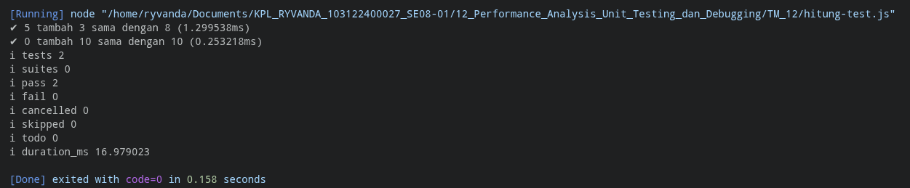

# Tugas Mandiri 12: Performance Analysis, Unit Testing, dan Debugging

  **Nama** : Ryvanda  
  **NIM** : 103122400027  
  **Kelas** : SE-08-01  

## Tugas

Bisakah kamu tunjukkan apakah kode sudah benar atau bagian mana yang perlu diperbaiki beserta alasannya?

## Program/Kode

File test: [hitung.js](./hitung.js), [hitung-test.js](./hitung-test.js)

## Output

Setelah diperbaiki:

## Deskripsi

Pada kode awal yang diberikan, terdapat sebuah kecacatan yang menyebabkan *unit test* tidak dapat berjalan sama sekali. Masalahnya bukan pada logika fungsi `tambahPengitung` itu sendiri—fungsinya sudah benar—melainkan pada **kurangnya kata kunci `export`** di depan deklarasi fungsi dalam berkas `hitung.js`.

Berkas `hitung-test.js` menggunakan standar **ESM (ES Modules)** dengan sintaks `import { tambahPengitung } from './hitung.js'` untuk mengambil fungsi dari `hitung.js`. Jika kata kunci `export` tidak ada pada fungsi di `hitung.js`, maka `import` tersebut tidak akan menemukan apapun yang diekspor. Akibatnya, `tambahPengitung` bernilai `undefined` dan pengujian gagal sebelum satu pun assertion dari *unit test* sempat dieksekusi.

Perbaikan yang diterapkan adalah menambahkan kata kunci `export` di depan deklarasi fungsi: `export function tambahPengitung(...)`. Modul pengujian yang digunakan adalah **`node:test`** yang merupakan modul bawaan (*built-in*) Node.js—tidak memerlukan instalasi *library* eksternal. Kasus ini menegaskan prinsip penting dalam *Unit Testing*: sebelum menguji kebenaran logika, pastikan terlebih dahulu bahwa komponen yang akan diuji dapat diakses (*exported* dan *importable*) oleh berkas pengujian.
