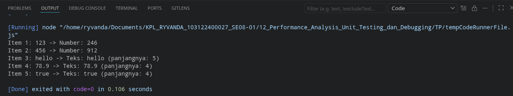

# Tugas Pendahuluan: Performance Analysis, Unit Testing, dan Debugging

**Nama:** Ryvanda
**NIM:** 103122400027
**Kelas:** SE-08-01

## Program/Kode

Tersedia di [index.js](./index.js)

## Output



## 📝 Jawaban Tugas Pendahuluan

Tugas Pendahuluan Modul 12 ini melatih kemampuan *debugging* secara sistematis—sebuah keterampilan esensial yang membedakan pengembang yang baik dari yang biasa. Alih-alih menebak-nebak penyebab masalah, *debugging* yang efektif dimulai dari membaca pesan *error* dengan cermat, memahami tipe data yang terlibat, dan menerapkan perbaikan yang tepat sasaran.

### 1. Analisis Bug dan Solusi Pemecahan Masalah

Kode awal yang diberikan dalam panduan mengandung sebuah *bug* tersembunyi yang hanya akan muncul saat *runtime*, bukan saat kode dikompilasi atau di-*lint*.

- **Permasalahan (Bug):** Di dalam fungsi `processData`, terdapat pemanggilan `data.toLowerCase()`. Bug ini adalah contoh klasik dari **Type Error**—sebuah operasi yang valid untuk satu tipe data (`String`) dipanggil pada nilai yang memiliki tipe berbeda. Karena array input di fungsi `main` bersifat heterogen (mencampur tipe `String`, `Number`, dan `Boolean`), program berjalan normal hingga bertemu elemen non-string pertama (angka `456`). Pada titik itulah eksekusi terhenti mendadak dengan error: `TypeError: data.toLowerCase is not a function`.

- **Solusi Penanganan (Fix):** Perbaikannya menerapkan prinsip *Defensive Programming*: sebelum memanggil method yang hanya tersedia untuk string, nilai dikonversi terlebih dahulu menggunakan `.toString()`:
  ```javascript
  const str = data.toString().toLowerCase();
  ```
  Dengan chain `toString().toLowerCase()`, fungsi ini terlebih dahulu memastikan bahwa nilai apapun (angka, boolean, objek) direpresentasikan sebagai string, *baru kemudian* operasi teks diterapkan. Ini membuat fungsi `processData` **type-safe** dan mampu menangani input heterogen tanpa *crash*.

### 2. Refleksi Proses Debugging
Kasus ini mengilustrasikan mengapa *Unit Testing* sangat penting (materi inti Modul 12). Sebuah unit test yang baik akan menguji fungsi `processData` dengan berbagai tipe input (string, number, boolean) dan akan langsung mendeteksi kegagalan ini *jauh sebelum* kode sampai ke lingkungan produksi. *Debugging* yang reaktif (memperbaiki setelah bug ditemukan) selalu lebih mahal dari *testing* yang proaktif (mencegah bug sebelum terjadi).
