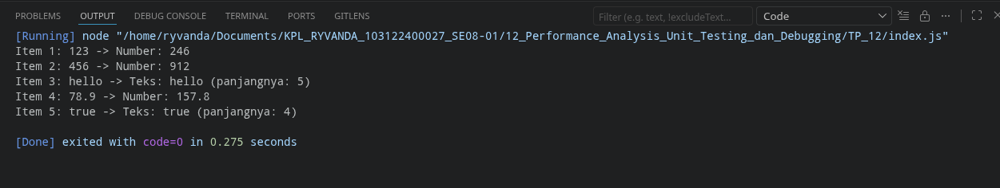

# Tugas Pendahuluan 12: Performance Analysis, Unit Testing, dan Debugging

  **Nama** : Ryvanda  
  **NIM** : 103122400027  
  **Kelas** : SE-08-01  

## Tugas

Cobalah untuk menangkap kecacatan dalam kode ini

```javascript
function main() {
  const data = [
    "123",
    456,
    "hello",
    78.9,
    true,
  ];

  for (let i = 0; i < data.length; i++) {
    const result = processData(data[i]);
    console.log(`Item ${i + 1}: ${data[i]} -> ${result}`);
  }
}

function processData(data) {
  const str = data.toLowerCase();
  const num = parseInt(str);
  if (!isNaN(num) && str === String(num)) {
    return `Number: ${num * 2}`;
  }
  return `Teks: ${str} (panjangnya: ${str.length})`;
}

main();
```

## Program/Kode

Tersedia di [index.js](./index.js)

## Output



## Deskripsi

Tugas Pendahuluan Modul 12 ini berfokus pada kemampuan mengidentifikasi *bug* tersembunyi melalui analisis tipe data—sebuah keterampilan mendasar dalam proses *debugging* dan *performance analysis* perangkat lunak.

### Identifikasi Bug

Kecacatan pada kode di atas terletak di baris `const str = data.toLowerCase();` di dalam fungsi `processData`. Fungsi `.toLowerCase()` adalah metode yang **hanya dimiliki oleh tipe data `String`**. Sementara itu, array `data` di dalam fungsi `main` bersifat heterogen—berisi campuran `String`, `Number`, dan `Boolean`. Akibatnya, program akan berjalan normal saat memproses elemen `"123"` (string), namun langsung *crash* begitu bertemu elemen `456` (number), karena tipe `Number` tidak memiliki metode `.toLowerCase()`. Error yang dihasilkan adalah `TypeError: data.toLowerCase is not a function`.

### Solusi Perbaikan

Perbaikan dilakukan dengan menerapkan prinsip *Defensive Programming*: konversi tipe data ke `String` terlebih dahulu sebelum memanggil metode string apapun.

```javascript
// Sebelum (bug):
const str = data.toLowerCase();

// Sesudah (fix):
const str = data.toString().toLowerCase();
```

Dengan menggunakan `.toString()` sebagai langkah pertama, fungsi `processData` menjadi **toleran terhadap berbagai tipe input**. Nilai `456` dikonversi menjadi `"456"`, nilai `true` menjadi `"true"`, dan nilai `78.9` menjadi `"78.9"` sebelum `.toLowerCase()` dipanggil, sehingga tidak ada lagi risiko `TypeError`.

### Refleksi

Kasus ini mencontohkan mengapa *type checking* dan *input validation* penting, terutama dalam bahasa yang bersifat *dynamically typed* seperti JavaScript. Sebuah *unit test* yang komprehensif—yang menguji fungsi `processData` dengan semua tipe data yang mungkin—akan mampu mendeteksi bug ini secara otomatis jauh sebelum kode tersebut dijalankan di lingkungan produksi.
